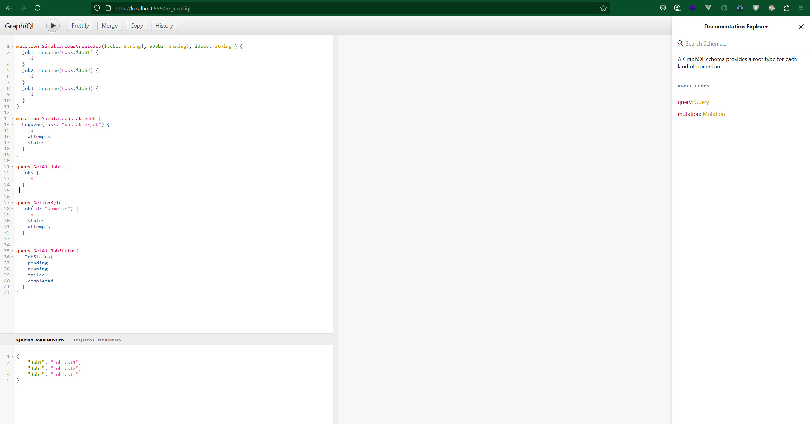

# Simple Distributed Job Queue Simulation
a simple job queue system built by golang

## Requirement:
-> Go >= 1.20

## How to Run:
-> on VsCode -> Run(Pick Go-Debug)
-> open localhost:58579/graphiql
-> should be look like this

## The use .graphql files to define the schema
> Using .graphql files follows a Schema-First Development approach. This practice treats the schema as a clear, language-agnostic contract between the frontend and backend. It serves as a single source of truth that both teams can rely on and is supported by a wide range of developer tools for testing and documentation.

## Embedding the .graphql files in the binary
> Embedding the schema files into the final program (the binary) is for portability and deployment reliability. It packages the entire application into a single, self-contained executable file. This means you don't have to worry about copying extra files to the server or dealing with incorrect file paths in a production environment. The schema is guaranteed to be available because it's part of the program itself.

##  Why is schema.go necessary and how is the method String() used?
> This file acts as a clean "bridge" to the embedded schema data. It hides the complex, auto-generated code in bindata.go from the rest of your application. The String() function reads all the separate .graphql files that were embedded into the binary, concatenates them into a single string, and returns it. This complete schema string is then used in main.go to initialize the GraphQL server.